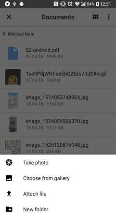
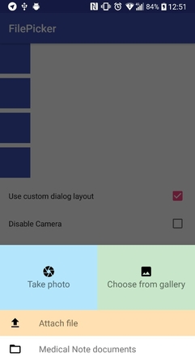
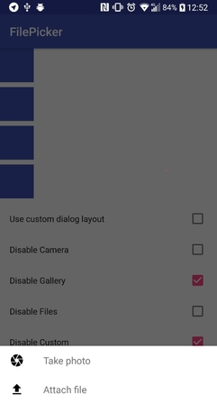

# AsyncFilePicker

###### !!! Some features may work unstable, make sure you have tested it. Thanks.

**Feel free to fork or issue pull requests on github. Issues can be reported on the github issue tracker.**

File picker allows you to take photo and files from camera\gallery\filesystem 
and also you can add up to 3 own custom actions.

Picker will ask for camera and gallery permission on android version 6.0 or above.

 

# Install
To add this library to your project, you must add the JitPack repo to your root build.gradle file...

```groovy
allprojects {
 repositories {
    ...
    jcenter()
 }
}
```

Then include this in your dependencies block

```groovy
implementation 'org.shagi:filepicker:0.4'
```

# Usage

1. Add provider block to your's AndroidManifest.xml
```xml
        <provider
            android:name="android.support.v4.content.FileProvider"
            android:authorities="${applicationId}.provider"
            android:exported="false"
            android:grantUriPermissions="true">
            <meta-data
                android:name="android.support.FILE_PROVIDER_PATHS"
                android:resource="@xml/provider_paths"/>
        </provider>
```
2. Create file provider_paths.xml
```xml
<?xml version="1.0" encoding="utf-8"?>
<paths>
    <files-path name="files_picked" path="picked" />
</paths>
```
3. For simple use instantiate FilePickerFragment and in OnClick method pass FilePickerDialog into fragment.

*ExtFile* - wrapper object for File object with additional data such as (baseUri, mimeType, fileName)
```kotlin
        val pickerFragment = FilePickerFragment.getFragment(supportFragmentManager)
        view.setOnClickListener {
                    pickerFragment.use(initFilePickerDialog())
                    pickerFragment.setOnLoadingListener(object : FilePicker.OnLoadingListener {
                        override fun onLoadingStart(key: Long) {
                            imageView.setImageResource(R.color.colorAccent)
                            textView.text = "loading"
                        }
        
                        override fun onLoadingSuccess(key: Long, file: ExtFile) {
                            textView.text = file.toString()
        
                            Picasso.with(this@SampleActivity)
                                    .load(file.file)
                                    .into(imageView)
                        }
        
                        override fun onLoadingFailure(key: Long, throwable: Throwable) {
                            textView.text = throwable.message
                        }
        
                    })
                    pickerFragment.show()
                }

```

### Available functions

##### Customisation

You can customise picker dialog with own layout. Override onCreateView method and pass there layout with same view ids as in base FilePickerDialog layout - file_picker_dialog_layout
```kotlin
class CustomPicker : FilePickerDialog() {

    override fun onCreateView(inflater: LayoutInflater, container: ViewGroup?, savedInstanceState: Bundle?): View =
            inflater.inflate(R.layout.file_picker_layout, container, false)

}
```

 

##### Cache and Settings

**By default each file and photo returned overrides one temp file, and you have to save this file by yourself.**

If you want to upload multiple in one time you cant turn cache on by passing true as second param to FilePickerFragment.getFragment(fm,useCache).

You can setup maxCacheSize, maxFileSize, maxWidth, maxHeight use FilePickerFragment.setup(FilePickerSettings) method

```kotlin
        val pickerFragment = FilePickerFragment.getFragment(supportFragmentManager, true).apply { 
            use(initFilePickerDialog())
            setup(settings)
        }
```

```kotlin
    private fun initFilePickerDialog() =
            if (useCustomLayout) { // to user Custom Picker
                CustomPicker()
            } else {
                FilePickerDialog.newInstance()
            }.apply {
                showCamera = !cameraDisabled // to show camera picker row
                showGallery = !galleryDisabled // to show gallery picker row
                showFileSystem = !filesDisabled // to show file system picker row

                if (!customActionDisabled) { // to use custom action
                    addCustomAction(CustomActionItem(R.drawable.file_picker_ic_folder,
                            R.string.fpd_load_from_medical_note_documents,
                            View.OnClickListener {
                                Toast.makeText(context, "Custom action clicked", Toast.LENGTH_SHORT).show()
                            })
                    )
                }
            }
```



# License


    Copyright 2018 shagiz
    
    Licensed under the Apache License, Version 2.0 (the "License");
    you may not use this file except in compliance with the License.
    You may obtain a copy of the License at

       http://www.apache.org/licenses/LICENSE-2.0

    Unless required by applicable law or agreed to in writing, software
    distributed under the License is distributed on an "AS IS" BASIS,
    WITHOUT WARRANTIES OR CONDITIONS OF ANY KIND, either express or implied.
    See the License for the specific language governing permissions and
    limitations under the License.
